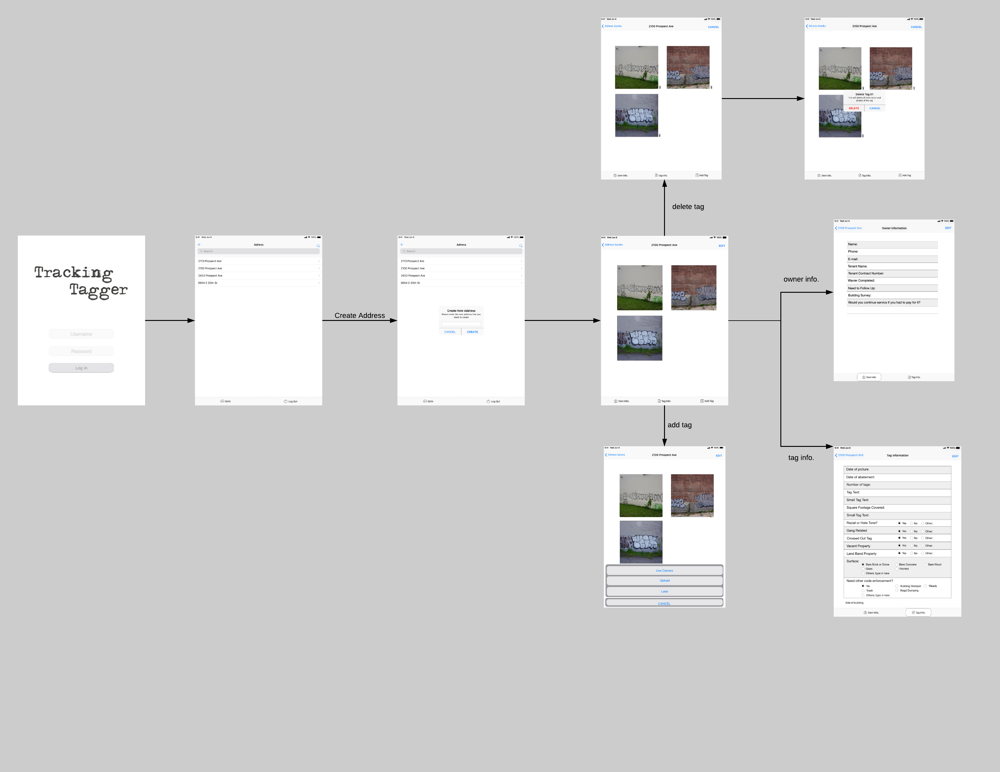

#### Edit: this repo is old
view active repo [here](https://github.com/codeforkansascity/tagging-tracker-pwa)

### About
The purpose of this app is to take pictures of graffiti and store them to the corresponding address to then be abated(removed). This app is intended to work primarily offline so it is using in-memory state management or local storage eg. `Dexie` an `IndexedDB` wrapper.

The photos are turned into base64 to be stored as strings locally. There is remote API and storage system(S3). You authenticate to sync up to the remote side which is pretty much going to be a copy of the client-side `Dexie` schema. The primary table is the address table and the address id ties to the other tables eg. tags, owner info, etc...

Here's a mock up of the app

### Stack
#### Front end
- ReactJS PWA, auth by JWT

#### Back end
- Node
- Express
- MySQL
- S3

Check out the front/back-end folders for more info like structure/development/deployment

