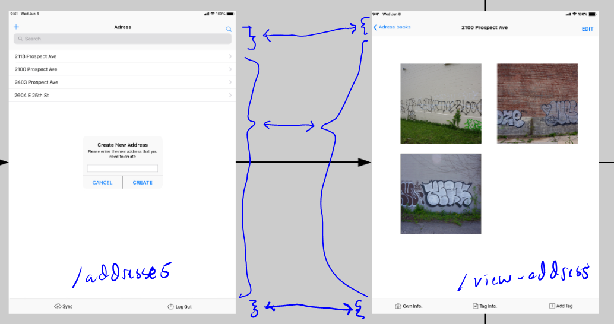

### About
This app is built pretty much in 3 parts:
* navbar
* body
* bottomNavbar

The router decides what to render inside the contents. Here's a crude annotation of example shared views. You can see this in `App.js`

### Dependencies
- `node/npm/npx`
- if you're using Ubuntu/linux you may see an issue about file system watchers, check [this link out](https://github.com/facebook/jest/issues/3254#issuecomment-297214395)

### Notes:
* Disable proxy when building for deployment
    * Proxy is used for local API testing, set in `package.json`
* Refreshing will remove your token since it's held in state, not local/session storage or cookie
    * this will probably get changed soon, along with the `Link`-based route state eg. what address you're viewing since people will inevitably refresh the app by pulling down and that will wipe the app state.
* There is no refresh token currently, expiration is 30m

#### Notes about `Dexie`:
If you're not familiar with `IndexedDB` it's another form of client/browser storage like localStorage/sessionStorage but instead of just storing strings/key-value pairs, you have an entire table system just like `MySQL` or `Postgresql` etc... but I mainly am using it to store the images alongside the other data eg. addresses/tag info/owner info/etc...
Anyway in devtools under application you can inspect/delete the `IndexedDB` which is what `Dexie` is a wrapper for.

### Install
Provided you've met the dependencies above, you will just need to cd into the `tagging-tracker-pwa` directly and run `npm install`, if no errors you should be good to go

### Run
`npm start` or `yarn start` which ever one you have

### Online/Offline behavior workflow
The login should only popup when you're trying to sync and your token has expired(API middleware rejects it). Everything works/stores on the client storage(`Dexie IndexedDB`). There are event listeners for online/offline events. These will toggle the sync button(disable/enable). The sync process will send up copies of the differnet tables and the images themselves(may already be done by add tag process). I'm still not sure what to treat as the source of truth eg. client or remote. So if there are less tables on client than remote, does that mean you want to delete the ones on remote, or you lost some data on client...

### Outstanding things to finish/fix
- [ ] update CSS layout so components are fixed in height based on vh since pieces are flexed to grow
    - this is primarily for when the soft keyboard appears on a mobile device and reduces the height of the page
- [ ] search not functional
    - not hard just got derailed replacing API-based storage/search with local `Dexie`-based
- [ ] delete prompt not integrated to delete proces
    - the storage/grouping has to get reorganized I misunderstood that the pictures were separate regarding the tag info/owner info
        - they are being kept as one for now, can restructure
- [ ] sync button disable toggle not tied to online/offline events
- [ ] prevent window from collapsing when keyboard comes up
    - this is easy CSS
- [ ] when you hit edit(while data saved) on owner info, content is emptied
- [ ] increase font size on bottom buttons tag upload page
    - this is on mobile
- [ ] finish figuring out what's up with image meta for preview sizing
- [ ] [extra] add some kind of saving spinner maybe
- [ ] big photos take a while to load, interesting even locally stored
    - [ ] thumbnail generator is needed, possibly caching somehow or using synchronous in-memory over async eg. `Dexie`... or a spinner
- [ ] delete turned off until flow set(prompt) and also restructure data
- [ ] the tag info table is not done yet, this one is way more complex than the owner info form

I'll do a more thorough analysis to get the MVP ready with remote sync. It's going to be done by next Monday 02/03/2020. I have writen/figured out all the parts that's needed eg. multi-part image upload from client side to Node API(through `multr`) then to S3, I mean AWS's sdk does all of it for you.

I do have to finish the rest of the tables for Node/MySQL and the rest of the routes but it's not hard. I did the unknowns first for me.